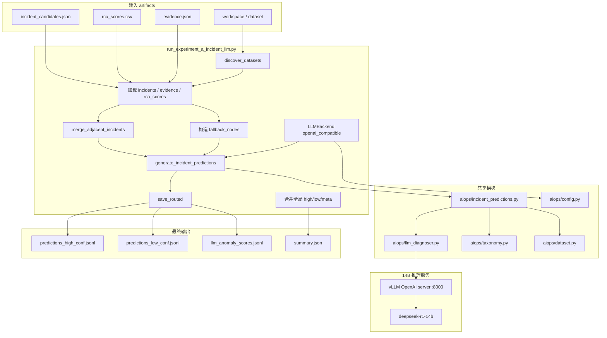
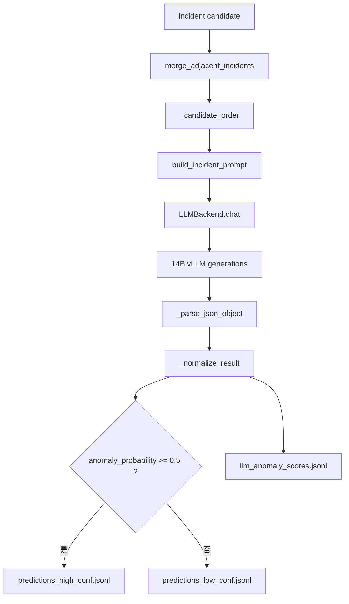
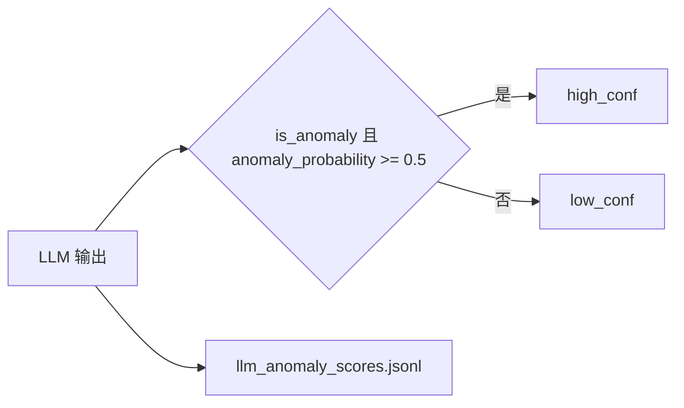

# 实验 A 代码架构图

## 1. 总览



## 2. 单个 incident 的处理流程



## 3. 高/低置信分流



## 4. 主要文件职责

| 文件 | 职责 |
|---|---|
| `run_experiment_a_incident_llm.py` | 实验 A 入口，遍历 dataset，加载 artifacts，调用 incident LLM |
| `aiops/incident_predictions.py` | 相邻 incident merge、prompt 构造、LLM 解析、高/低置信路由 |
| `aiops/llm_diagnoser.py` | `LLMBackend`，支持 OpenAI-compatible/vLLM |
| `aiops/taxonomy.py` | 官方封闭故障类别枚举 |
| `aiops/dataset.py` | dataset 发现、官方 network_element_id |
| `aiops/config.py` | LLM 配置、阈值、experiment 配置 |

## 5. 关键输入输出

### 输入

```text
outputs_ablation_full/_ablation/full/<dataset>/
  incident_candidates.json
  rca_scores.csv
  evidence.json
```

### 输出

```text
outputs_experiment_a_incident_llm/
  predictions_high_conf.jsonl
  predictions_low_conf.jsonl
  llm_anomaly_scores.jsonl
  summary.json
```
